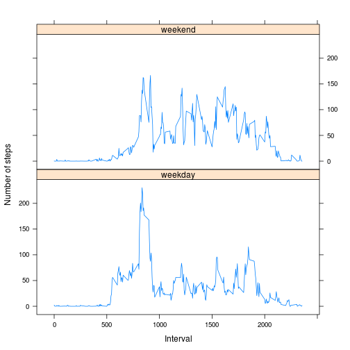

## Loading and preprocessing the data

```r
cl <- c("numeric", "Date", "numeric")
acdata <- read.csv("activity.csv", header = TRUE, colClasses = cl)
acdata.naremoved <- na.omit(acdata)
```


## What is mean total number of steps taken per day?

```r
stepsperday <- aggregate(acdata.naremoved$steps, by=list(acdata.naremoved$date), FUN=sum)
names(stepsperday) <- c("date","steps")
hist(stepsperday$steps, main = "Histogram of total number of Steps taken each day", xlab = "Steps taken each day")
```

 

```r
paste("mean = ",mean(stepsperday$steps))
```

```
## [1] "mean =  10766.1886792453"
```

```r
paste("median = ",median(stepsperday$steps))
```

```
## [1] "median =  10765"
```

## What is the average daily activity pattern?

```r
stepsperinterval <- aggregate(acdata.naremoved$steps, by=list(acdata.naremoved$interval), FUN=mean)
names(stepsperinterval) <- c("interval", "steps")
plot(stepsperinterval$interval, stepsperinterval$steps, type = "l", xlab = "5-minute interval", ylab = "Average number of steps")
```

 

```r
paste("Interval with maximum steps = ",stepsperinterval[stepsperinterval$steps == max(stepsperinterval$steps),][1,1])
```

```
## [1] "Interval with maximum steps =  835"
```

## Imputing missing values
# Replace NAs with mean for that 5-minute interval

```r
paste("Total number of missing values = ",sum(is.na(acdata$steps))+sum(is.na(acdata$date))+sum(is.na(acdata$interval)))
```

```
## [1] "Total number of missing values =  2304"
```

```r
acdata.nafilled <- acdata
for (n in 1:nrow(acdata.nafilled))
{
if(is.na(acdata.nafilled[n,1]))
{
acdata.nafilled[n,1] <- round(stepsperinterval[stepsperinterval$interval == acdata.nafilled[n,3],2])
}
}
paste("After filling Missing values, Total number of missing values = ",sum(is.na(acdata.nafilled$steps))+sum(is.na(acdata.nafilled$date))+sum(is.na(acdata.nafilled$interval)))
```

```
## [1] "After filling Missing values, Total number of missing values =  0"
```

```r
stepsperday.nafilled <- aggregate(acdata.nafilled$steps, by=list(acdata.nafilled$date), FUN=sum)
names(stepsperday.nafilled) <- c("date","steps")
hist(stepsperday.nafilled$steps, main = "Histogram of total number of Steps taken each day", xlab = "Steps taken each day")
```

 

```r
paste("mean = ",mean(stepsperday.nafilled$steps))
```

```
## [1] "mean =  10765.6393442623"
```

```r
paste("median = ",median(stepsperday.nafilled$steps))
```

```
## [1] "median =  10762"
```
### Slight change noticed in mean, median and total number of steps after filling missing values

## Are there differences in activity patterns between weekdays and weekends?

```r
library(lattice)
acdata.nafilled <- transform(acdata.nafilled, weekend=ifelse(as.POSIXlt(acdata.nafilled$date)$wday %in% c(0, 6), "weekend", "weekday"))
stepsperday.nafilled.byday <- aggregate(acdata.nafilled$steps, by=list(acdata.nafilled$interval, acdata.nafilled$weekend), FUN=mean, na.rm = TRUE)
names(stepsperday.nafilled.byday) <- c("interval", "day", "avgsteps")
xyplot(avgsteps ~ interval | day, data = stepsperday.nafilled.byday, layout = c(1, 2), type = "l", xlab = "Interval", ylab = "Number of steps")
```

 

